# Einfluss von Buntheit auf den wahrgenommenen Realismus rekolorierter Bilder

## Erdem Arslan, Savas Großmann, Marius Krause, Max Mühlefeldt

### Seminar: Visuelle Wahrnehmung beim Menschen und Bildqualität - WiSe 2021/22

## Inhaltsverzeichnis

* [Einleitung](#1-einleitung)
* [Vorbereitung der Stimuli](#2-vorbereitung-der-stimuli)
* [Experimentelles Design](#3-experimentelles-design)
* [Ergebnisse](#4-ergebnisse)
* [Diskussion](#5-diskussion)
* [Referenzen](#referenzen)

Der Ordner `code` in diesem Repository enthält den gesamten verwendeten Code. Im Ordner `presentations` sind die Folien hinterlegt, wie sie in den Präsentationen im Rahmen des Seminars gehalten wurden.

## 1. Einleitung

Historische Schwarz-Weiß-Fotografien können mittels Machine Learning Algorithmen nachträglich eingefärbt bzw. rekoloriert werden. Wir untersuchen den Einfluss der Buntheit der eingefärbten Bilder auf den wahrgenommenen Realismus. Die vorliegende Fragestellung ist, welchen Einfluss die Buntheit auf den wahrgenommenen Realismus der rekolorierten Bilder hat. Als Hypothese wird angenommen, dass ein bunteres, nachträglich eingefärbtes Bild als realistischer wahrgenommen wird.

Die Untersuchung erfolgt anhand von historischen und modernen Fotografien. Diese werden eingefärbt und neun Varianten unterschiedlicher Buntheit erstellt. Versuchspersonen wurden die Varianten der Bilder gezeigt und nach der realistischsten Variante eines Bildes gefragt.

### Buntheit

Wir gehen zunächst auf den Begriff der Buntheit und den CIELAB Farbraum ein, der unter anderem die Manipulation der Buntheit erlaubt. 

#### Allgemein


Zentraler Begriff der vorliegenden Untersuchung ist Buntheit bzw. Chroma. Hier wird Buntheit als Anteil von Schwarz __und__ Weiß in einer Farbe verstanden. Je mehr Schwarz- und Weißanteil in einer Farbe enthalten ist, desto geringer ist die Buntheit einer Farbe. Verdeutlicht wird dies und der Unterschied zur Sättigung (nur Weißanteil) im Farbtongleichen Dreieck [1]:


#### CIELAB Farbraum

Basierend auf DIN EN ISO/CIE 11664-4 werden die Bilder in den CIE 1976 L* a* b* Farbraum konvertiert (nachfolgend CIELAB Farbraum). Im CIELAB Farbraum ist die Buntheit von jeder Farbe bzw. jedem Bildpunkt berechen- und manipulierbar. Für jeden Bildpunkt werden im CIELAB Farbraum die folgenden Informationen gespeichert:

* L*: Helligkeit
* a*: Rot-Grün-Buntheit
* b*: Gelb-Blau-Buntheit

Die Buntheit kann mittels der Formel 

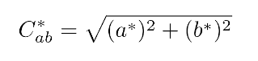

für jeden Bildpunkt errechnet werden. Die Buntheit eines Bildpunktes ist somit von a* und b* abhängig. Eine einfache Darstellung des Zusammenhangs von a*, b* und der Buntheit im CIELAB Farbraum kann der folgenden Darstellungen entnommen werden [2]:


Die Abbildung zeigt, dass eine Änderung der Buntheit (Chroma in der Abb.) den Farbton nicht beeinflusst (Hue in der Abb.).

Farbraumkonvertierungen vom sRGB zum CIELAB Farbraum und umgekehrt wurden mittels des `skimage` Pakets für Python 3 umgesetzt [3]. Beispielhaft zeigen wir die Konvertierung von sRGB zu CIELAB:

```python
from skimage import io, color
# Read image from path and perform conversion.

lab_image = color.rgb2lab(io.imread(file_path))
```

Die Manipulation der Buntheit eines Bildes im CIELAB Farbraum erfolgt durch elementweise Matrixmultiplikation. Die Einträge für einen Bildpunkt werden mit dem Vektor `[1, f, f]` elementweise multipliziert. Dabei ist f der Faktor, um den die Buntheit angepasst wird:
* L* (Helligkeit): Bleibt durch Multiplikation mit 1 unverändert.
* a* und b*: Beide Einträge werden durch die elementweise Multiplikation mit f angepasst.

Eine entsprechende Matrix für das gesamte Bild kann wie folgt erstellt werden.

```python
import numpy as np

def get_modification_matrix(chroma_factor, requested_shape) -> np.ndarray:
    """ Get matrix for element wise multiplication in the request shape.
    Usually the shape is equal to the shape of the original image
    as provided by the ML algorithm. """

    # Get the vector [1, f, f] with f as mod. factor.
    vector_to_multiply_elementwise = np.array([1, chroma_factor, chroma_factor])

    # Return matrix in the desired shape.
    return np.tile(
        vector_to_multiply_elementwise[None][None], (requested_shape[0], requested_shape[1], 1)
    )
```

Die elementweise Multiplikation erfolgt mittels der Funktion `modify_lab_image_chroma()`:

```python
def modify_lab_image_chroma(chroma_factor, image_to_modify):
    """ Modify the provided image in Lab color space by given chroma factor. """
    # Generate the modifier matrix.
    modifier = get_modification_matrix(chroma_factor, image_to_modify.shape)

    # Elementwise multiplication of original image.
    modified_image = image_to_modify * modifier
```

#### Hinweis zum CIELAB Farbraum

Die Buntheit im CIELAB Farbraum kann beliebig angepasst werden. Jedoch ist ein Konvertierung dieser Werte in einen anderen Farbraum nur noch bedingt möglich. Gerade für die Darstellung auf Computerbildschirmen ist eine Konvertierung in den sRGB-Farbraum notwendig. Entsprechend sieht auch das `skimage` Paket Limitierungen für die Konvertierung aus dem CIELAB Farbraum vor. So müssen a* und b* im Intervall [-100, 100] in den reellen Zahlen liegen. Es ergibt sich somit auch, dass die Buntheit im Intervall [0, 100] liegt.

#### Wahl der Buntheitsfaktoren

Basierend auf den oben gezeigten Grenzen für die Manipulation der Buntheit sind die Faktoren für die Manipulation der Buntheit zu wählen. Die Varianten eines Bildes mit unterschiedlichen Buntheiten enthält in der vorliegenden Untersuchung immer:
* Faktor 1,0: Buntheit des Bildes, wie durch den Algorithmus generiert (original rekoloriertes Bild).
* Faktor 0,6: Buntheit reduziert um Faktor 0,6. Hintergrund ist, dass sichergestellt wird, das den Versuchspersonen auch immer eine weniger bunte Variante gezeigt wird, als durch den Algorithmus generiert wird. Es wäre möglich, dass der Algorithmus grundsätzlich zu bunte Bilder generiert. 0,6 wurde gewählt, da ein hinreichend wahrnehmbarer Abstand zu Faktor 1,0 in Vorversuchen beobachtet wurde, ohne dass der Eindruck eines reinen Schwarz-Weiß-Bildes entsteht.
* Faktor max: Basierend auf der höchsten Buntheit des gesamten original rekolorierten Bildes, der höchst mögliche Buntheitswert. Wie durch die folgende Funktion bestimmt:
```python
import numpy as np
def get_max_chroma_factor(image_to_modify):
    """Calculate max possible Chroma value."""
    min_a = np.abs(np.amin(image_to_modify[:, :, 1]))
    max_a = np.abs(np.amax(image_to_modify[:, :, 1]))
    min_b = np.abs(np.amin(image_to_modify[:, :, 2]))
    max_b = np.abs(np.amax(image_to_modify[:, :, 2]))
    max_abs_value = max(min_a, max_a, min_b, max_b)
    ab_abs_max = 99
    return ab_abs_max / max_abs_value
```
* Die verbleibenden sieben Faktoren: Die weiteren Faktoren werden mittels Interpolation bestimmt. Die Bestimmung der Buntheitsfaktoren eines Bildes erfolgt in `03_modify_chroma/main.py` mittels Funktion `get_factors_between_min_max()` mit Eingabeparametern `min_value=0.6` für den kleinsten Faktor und `max_value` der berechnete maximal mögliche Buntheitswert:

```python
from scipy.interpolate import Akima1DInterpolator
from scipy.optimize import curve_fit
import numpy as np

def get_factors_between_min_max(min_value, max_value) -> list:
    """Calculate chroma manipulation factors between min, 1.0 and max value."""
    # 1. step: Get linear function between (min_value, 0) and (max_value, 8).
    # Background: Needed to calculate the position of the factor == 1.0
    def fit_func(x, a, b):
        return a*x + b
    popt, pcov = curve_fit(fit_func, [min_value, max_value], [0, 8])

    # 2. step: Using three known factors (min, 1.0, max) fit interpolated function.
    
    # Get number of factor == 1. Needed to know position within the 9 factors.
    # Example: Worst case max factor == 1 -> factor == 1 is the factor with index 8.
    factor_num_1 = int(fit_func(1.0, *popt))
    if factor_num_1 < 1.0:
        factor_num_1 = 1.0
    fixed_factors_y = [min_value, 1.0, max_value]
    fixed_factors_x = [0, factor_num_1, 8]
    calculated_function = Akima1DInterpolator(fixed_factors_x, fixed_factors_y)

    # 3. step: Calculate nine chroma factors:
    x_range = np.arange(9)
    return list(calculated_function(x_range))
```

Im Ergebnis erhalten wir Buntheitsfaktoren für jedes Bild mit festen Faktoren, hier am Beispiel für Bild `I04`:

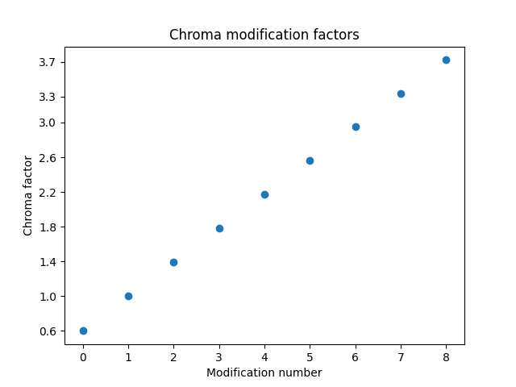

### Machine Learning Modell

Zum Einsatz kommt hier ein bereits trainiertes Machine Learning (nachfolgend ML) Modell. Das Modell wurde durch Zhang et al. entwickelt [4]. Benutzung des ML Algorithmus, wie in `code/image_generation/02_recolor/recolor.py` umgesetzt:

```python
from colorization.colorizers import *

# Recolor steps:
(tens_l_orig, tens_l_rs) = preprocess_img(img, HW=(256,256))
out_img = postprocess_tens(tens_l_orig, colorizer(tens_l_rs).cpu())
```

Zu beachten ist, dass das Modell nur mittels moderner Bilder trainiert wurde. Im Training wurde ein Bild im CIELAB Farbraum, dessen Buntheitswerte a* und b* entfernt wurden, als Eingabe für das Modell verwendet. Der Output des Modells wurde mit dem originalen Bild, samt Buntheitswerten, verglichen. Basierend auf dem Vergleich erfolgte das Training des Modells, wie in dieser Abbildung gezeigt [4]:

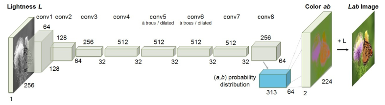


Mit dieser Methode ist es nicht möglich das Modell mit den historischen Bildern zu trainieren, da keine Buntheitswerte für einen Vergleich existieren.

## 2. Vorbereitung der Stimuli

### Auswahl der Bilder
Es wurden historische und moderne Bilder gewählt. Dabei wurden 30 historische Bilder aus verschiedenen Quellen zusammengetragen. Das Augenmerk lag darauf, möglichst vielfältige Themen abzudecken. So sind z.B. Architektur-, Landschafts- und Portraitaufnahmen vertreten.


Die modernen Bilder stellen eine kleinere Kontrollgruppe von 15 Bildern da. Mit unter anderem diesen Bildern wurde der verwendete Machine Learning Algorithmus trainiert [4]. Die modernen Bilder wurden der Tampere Image Database 2013 entnommen [5]. Die Themen der Bilder entsprechen den verwendeten Themen der historischen Bilder.

### Ablauf der Erstellung

Für die Erstellung der Stimuli sind die nachfolgenden Schritte auszuführen. Alle Verweise beziehen sich auf die Ordner in `code/image_generation`. Jede Datei ist nur einmal auszuführen. Alle Bilddateien in den jeweiligen Ordnern werden jeweils abgearbeitet.


* `00_base_images`: Ordner mit den originalen, unveränderten Bildern. Hier liegen die modernen Bilder noch als farbige Version vor.
* `01_conversion_modern_images_to_to_bw`: Mit Ausführung von `create_bw_colors.py` werden ausschließlich die modernen Bilder aus `00_base_images/modern` in schwarz-weiße-Bilder umgewandelt. Die Bilder werden hierzu in den CIELAB-Farbraum konvertiert. Die Buntheitswerte der Bildpunkte werden im Anschluss auf 0 gesetzt. Zum Abschluss werden die Bilder im Unterordner `export` gespeichert.
* `02_recolor`: Zur Rekolorierung der historischen und modernen Bilder `recolor.py` ausführen. Der oben vorgestellte Machine Learning Algorithmus wird verwendet. Die resultierenden Bilder werden im Unterordner `export` gespeichert.
* `03_modify_chroma`: Zur Generierung der unterschiedlich bunten Versionen eines Bildes aus dem vorhergehenden Schritt `main.py` ausführen. Die resultierenden Bilder sowie eine individuelle Übersicht für jedes Bild werden im Ordner `04_completed_images` gespeichert. Eine Beispielübersicht mit den jeweils angewandten Faktoren für die Anpassung der Buntheit:

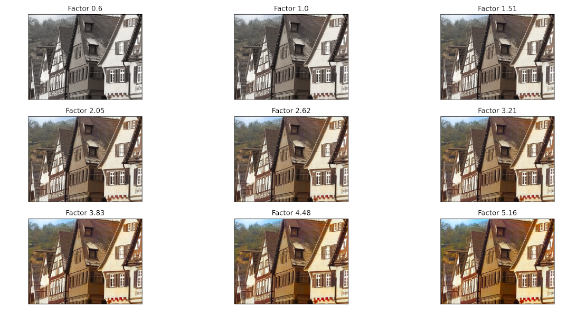


## 3. Experimentelles Design

Unseren Versuch haben wir in zwei verschiedene Experimente aufgeteilt.
1. Das Hauptexperiment „Neuner“ und 
2. das Kontrollexperiment „Single“.

Die Testbilder werden mit der Python Anwendung `code/nines/generate_pictures_file.py` in die richtige Form und Größe gebracht, damit sie später bei den Versuchen benutzt werden können. Außerdem wird eine CVS Datei kreiert, welche der Neuner zur Nutzung der Bilder benötigt.

### Neuner
In unserem Hauptexperiment sehen Versuchspersonen jeweils dasselbe Bild in neun verschiedenen Buntheiten. Das originale Schwarz-Weiß-Bild ist in diesen Bildergruppen nicht vorhanden. Die Versuchsperson soll bei jeder Bildgruppe entscheiden welches Bild am realistischsten empfunden wird und mit einem Klick auf eine Zahl von eins bis neun die Entscheidung bestätigen.


Es wurden insgesamt 45 Bilder gezeigt. Aufgeteilt wurden diese Bilder in 30 historische und 15 moderne. Die Bilder wurden in jedem Durchlauf zufällig angeordnet, so dass die Chance minimiert wird, das Versuchspersonen beeinflusst werden durch vorherige Durchläufe.

Um selbst einen Versuch durchzuführen, müssen die Bilder im Ordner `nines/Pictures` inklusive der `pictures.csv` gespeichert werden, die durch `generate_pictures_file.py` erstellt wurde. Die Anwendung `nines/experiment_nines.py` kann dann gestartet werden. Diese liest `pictures.csv` aus und zeigt dem User die Bilder. Außerdem werden alle Eingaben des Users gespeichert und am Ende in einer CSV Datei im results Order gespeichert. Bei einem Neustart des Experiments werden die Bildergruppen wieder zufällig aneinandergereiht.

### Single
Bei unserem Kontrollexperiment wurde überprüft wie Bunt die Versuchspersonen das vom Algorithmus eingefärbte Bild ohne eine Veränderung der Buntheit empfinden. Hier haben wir für jede Bildergruppe lediglich ein Bild gezeigt und die Testperson sollte auf einer Skala von 0 (keine Farben) bis 9 (höchste Intensität an Buntheit) ihre Bewertung abgeben:


Zum Starten des Kontrollexperiments müssen die Bilder, welche bewerten werden sollen, in den Ordner `single_assessment/data`. Die Anwendung `single_assessment/rating_experiment_single.py` zeigt der Testpersonen die Bilder in einer zufälligen Reihenfolge und speichert die Ergebnisse im Order `results` als CSV Datei.

## 4. Ergebnisse

Die Analyse der Ergebnisse erfolgte mittels zweier Jupyter Notebooks in `code/analysis` jeweils für beide Experiment separat.

### Neuner - Historische Bilder

Nachdem eine befragte Person an dem Neuner Experiment teilgenommen hat, könnte das Ergebnis für die historischen Bilder exemplarisch folgendermaßen aussehen:

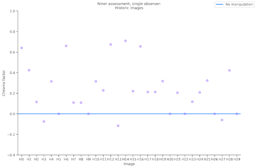

Auf der x-Achse sind hier die Bild-IDs abgebildet und auf der y-Achse der normierte gewählte Chromafaktor.
Bei Chromafaktor 0.0 befindet sich eine waagerechte blaue Linie. Diese symbolisiert den Chromawert, mit dem das Bild vom Algorithmus eingefärbt wurde.
Die Punkte in dem Diagramm zeigen dann die Antworten der Testperson.

Von uns wurden so 23 Versuchspersonen befragt und die Ergebnisse sind im folgenden Diagramm zusammengetragen.

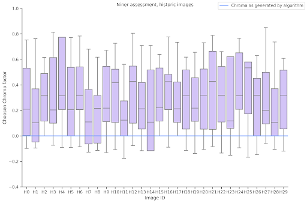

Es wurde schnell deutlich, dass für jedes Bild der Median der gewünschten Chromawerte über dem vom Algorithmus generierten Chromawert liegt.
Das bedeutet, dass die Versuchspersonen im Median eine buntere Version des Bildes als realistischster empfinden, als das Bild, das von Algorithmus generiert wurde.

Die zwei Bilder, die am weitesten außen des Antwortspektrums liegen, sind folgende:

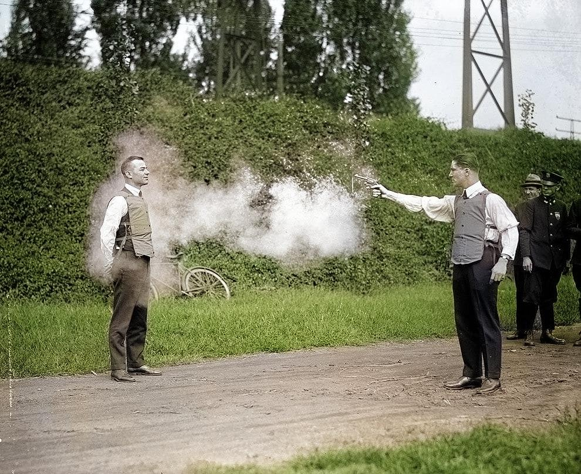

H25 wurde als das unrealistische Bild wahrgenommen. Hier halten die Versuchspersonen im Median folgende Version als am realistischsten:

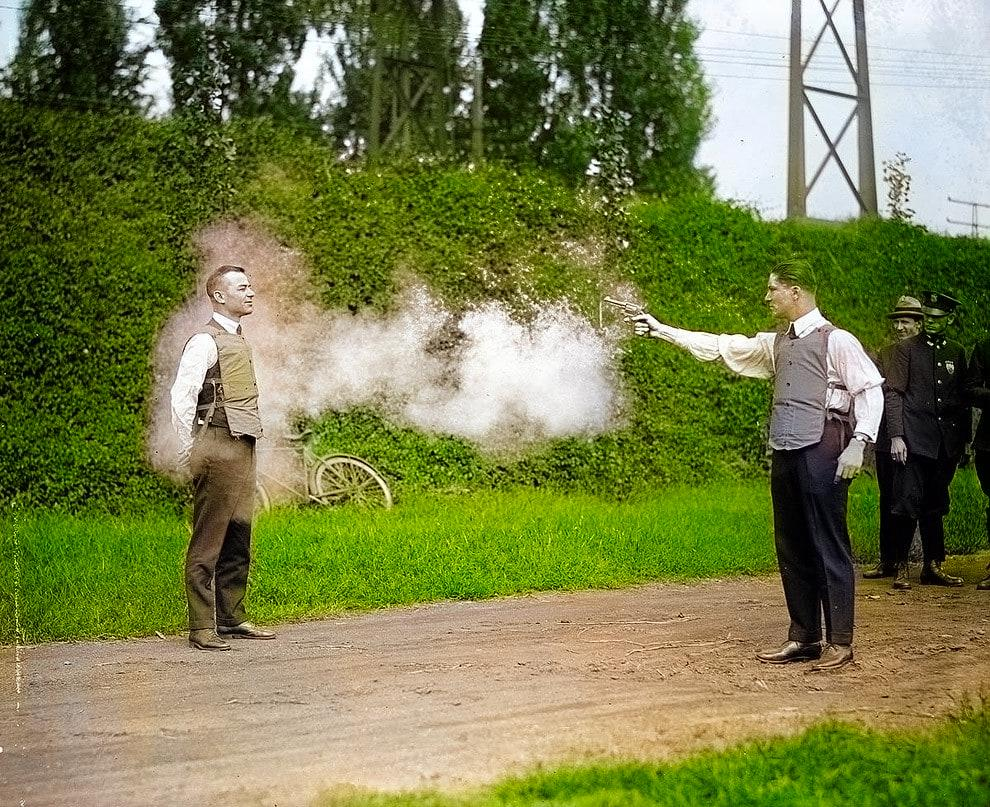

H11 dagegen wurde als das Bild bewertet, bei dem der Algorithmus die realistischste Version generiert hat.

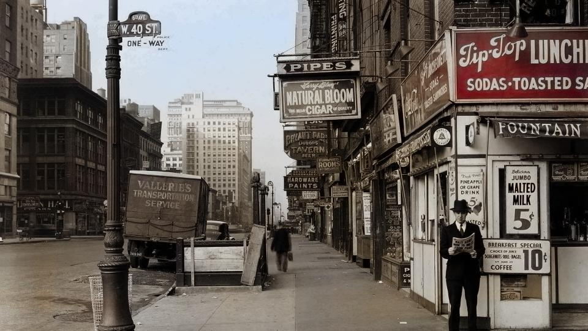

### Neuner - Moderne Bilder

Für die modernen Bilder konnten wir ein ganz ähnliches Ergebnis erzielen.

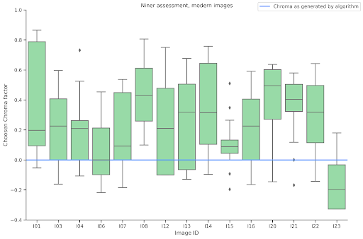

Auch hier wählten die Versuchspersonen im Median meistens buntere Versionen, als die vom Algorithmus generiert.

Zu den interessantesten Sonderfällen zählen hier I08, welches am unrealistischsten wahrgenommen wurde.

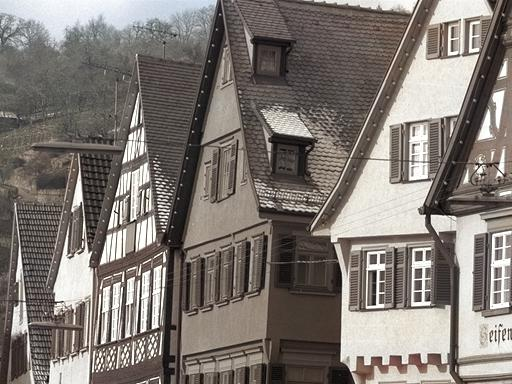

Hier haben die Probanden eher diese Version als realistisch empfunden.

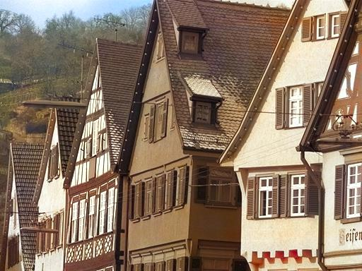

Das realistischste Bild ist I06 bei dem der Median genau auf dem Bild liegt, welches vom Algorithmus erzeugt wurde.

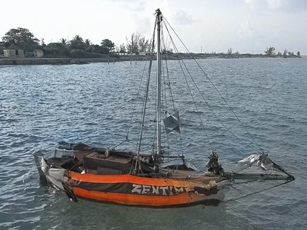

Als Ausreißer kann man an dieser Stelle noch I23 ansprechen. Bei diesem Bild haben die Versuchspersonen eine unbuntere Version als realistischer empfunden, als die vom Algorithmus generierte.

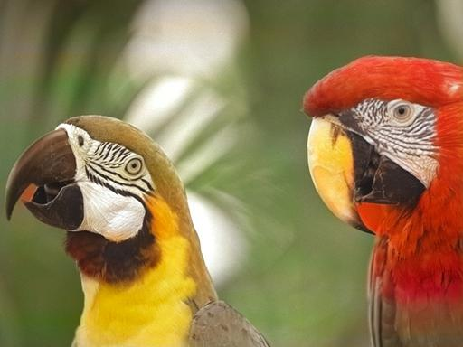

### Neuner - Vergleich der Bildgruppen

Im folgenden Diagramm sieht man die vereinigten Ergebnisse für die modernen und die historischen Bilder nebeneinander.
Dafür wurden die normierten arithmetischen Mittel jedes Bildes benutzt und daraus die Boxplots erstellt.

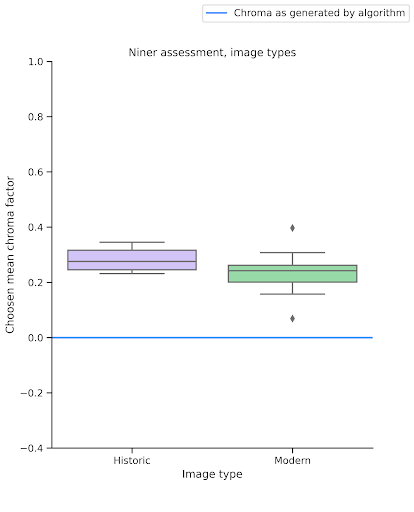

Hier kann man deutlich erkennen, dass Versionen, die vom Algorithmus erzeugt wurden, generell zu unbunt sind, um für die Versuchspersonen als die realistischsten wahrgenommen zu werden.

Ein t-Test zeigt hierbei einen signifikanten Unterschied zwischen den beiden Bildgruppen.

### Single - Vergleich der Bildgruppen

Bei dem Kontrollexperiment sind wir ähnlich vorgegangen. Der Vergleich der Bildgruppen zeigt hier Folgendes:

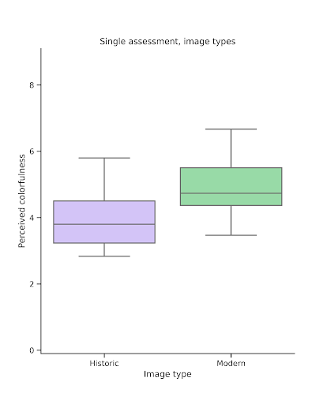

Man sieht, dass die modernen Bilder generell als bunter wahrgenommen werden als die historischen.
Auch hier zeigt ein t-Test einen signifikanten Unterschied.

### Zusammenführung der Versuchsergebnisse

Um die Ergebnisse der beiden Versuche nun zusammenzuführen wurden folgende Diagramme erstellt.
Die Regressionsanalysen wurden zwar mit sehr kleinen Stichproben durchgeführt, geben aber trotzdem eine grobe Tendenz der Zusammenhänge.

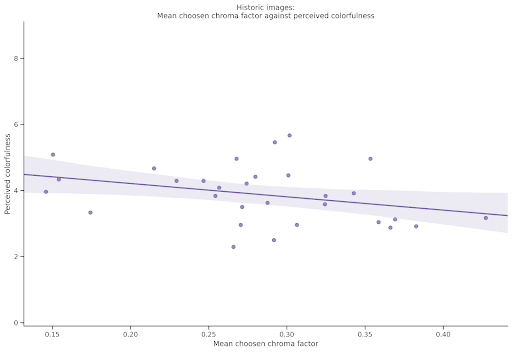

Das erste Diagramm zeigt nur um die historischen Bilder.<br/>
Auf der x-Achse sind die normierten arithmetischen Mittel der gewählten Chromawerte für jedes Bild aus dem Diagramm des Neuner-Experiments abgebildet.
Auf der y-Achse befinden sich die arithmetischen Mittel der wahrgenommenen Buntheiten für jedes Bild aus dem Diagramm des Single-Experiments.
Das Diagramm zeigt eine nicht signifikate, aber schwach ausgeprägte negative Korrelation mit einem Korrelationskoeffizienten von r = -0,3.<br/>
Damit lässt sich sagen, je bunter ein Bild wahrgenommen wird, desto näher ist das ursprünglich vom Algorithmus eingefärbte Bild an dem, welches am realistischsten wahrgenommen wurde.

Auf dem zweiten Diagramm sieht man das noch deutlicher.

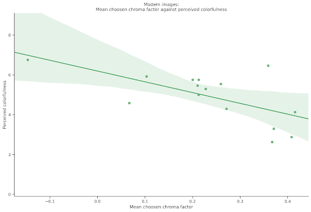

Bei diesem Diagramm handelt es sich um die gleiche Herangehensweise, wie bei dem Diagramm zuvor, nur das hier die modernen Bilder zur Grundlage genommen wurden.
Hier sieht man sogar einen signifikanten negativen Zusammenhang mit einem Korrelationskoeffizienten von r = -6.

## 5. Diskussion

Im Rahmen unseres Seminarprojekts haben die Auswertungen unserer Experimente gezeigt, dass Buntheit einen positiven Einfluss auf den wahrgenommenen Realismus der eingefärbten Bilder hat. Anfänglich sind wir davon ausgegangen, dass ein bunteres, nachträglich eingefärbtes Bild als realistischer wahrgenommen wird. Diese Erwartung hat sich nach den gewonnenen Erkenntnissen als wahr herausgestellt, jedoch nicht uneingeschränkt. Wird die Buntheit sehr stark erhöht, zeigen sich die Farben des Bildes als grell bzw. unnatürlich. Die Versuchspersonen nahmen diese Versionen nicht mehr als realistisch wahr.

Wir stellen fest, dass wir die rekolorierten Bilder aus dem Machine Learning Algorithmus [4] bunter gestalten können und sie dadurch als realistischer wahrgenommen werden. Folglich haben wir gezeigt, dass mit unserer Vorgehensweise der Algorithmus von Zhang et al., bezogen auf den wahrgenommenen Realismus, verbessert werden könnte.

### Mögliche Probleme 

Es hat sich gezeigt, dass es problematisch ist, den Versuchspersonen die Aufgabenstellung unserer beiden Experimente zu vermitteln. Ergebnisse einer Versuchsperson wurden teilweise verworfen, da die Aufgabenstellung nicht korrekt verstanden wurde. Damit solche Missverständnisse vermieden werden können, wäre es sinnvoll eine kurze Erläuterung anhand eines Beispiels zum Experiment hinzuzufügen, dass den Versuchspersonen vor Beginn des Experiments gezeigt wird.

In den gewählten historischen Bildern sind zudem bekannte Motive vertreten. So ist zum Beispiel ein Portrait von Elvis Presley Teil der historischen Bilder. Es könnte sein,
dass die Versuchspersonen Motive bereits in Schwarz-Weiß kannten. Es erscheint möglich, dass in solchen Fällen eine unbuntere Version des Bildes als realistischer bevorzugt wird.

Die Autoren selbst waren Teil der Versuchspersonen. Eine Beeinflussung der Ergebnisse der Autoren durch vorhandenes Vorwissen kann nicht ausgeschlossen werden. Obwohl keine Ausreißer in den Ergebnissen der Autoren festgestellt wurden.

### Offene Fragen

In weiterführenden Untersuchungen kann betrachtet werden, ob die Buntheitsanpassung dynamisch für einen Bildpunkt erfolgen kann. So könnte die Nachbarschaft eines Bildpunktes berücksichtigt werden und Bildpunkte in weniger bunten Bereichen eines Bildes bunter gemacht werden, als andere Bereiche.

## Referenzen

[1] Eva Lübbe. Farbempfindung, Farbbeschreibung und Farbmessung. 1. Auflage, Wiesbaden 2013.

[2] Konica Minolta. Precise Color Communication. Besucht am 08.12.2021, https://www.konicaminolta.com/instruments/download/booklet/index.html.

[3] scikit-image development team. Besucht am 21.03.2022, https://scikit-image.org/.

[4] Zhang et al. Colorful Image Colorization, ECCV Proceedings, 2016, [doi](https://doi.org/10.1007/978-3-319-46487-9_40).

[5] Tampere Image Database. Besucht am 13.12.2021, https://www.ponomarenko.info/tid2013.htm.
