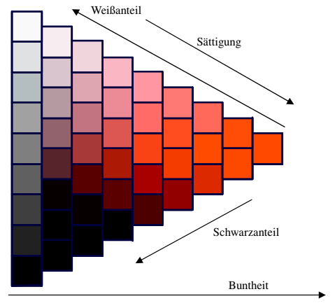
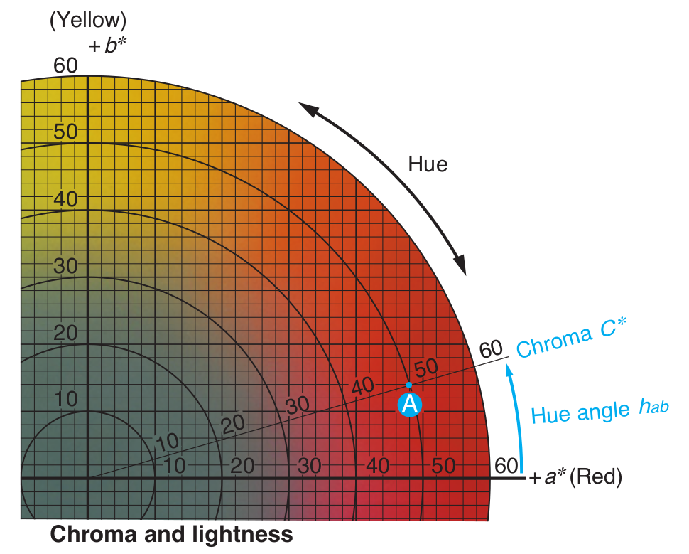
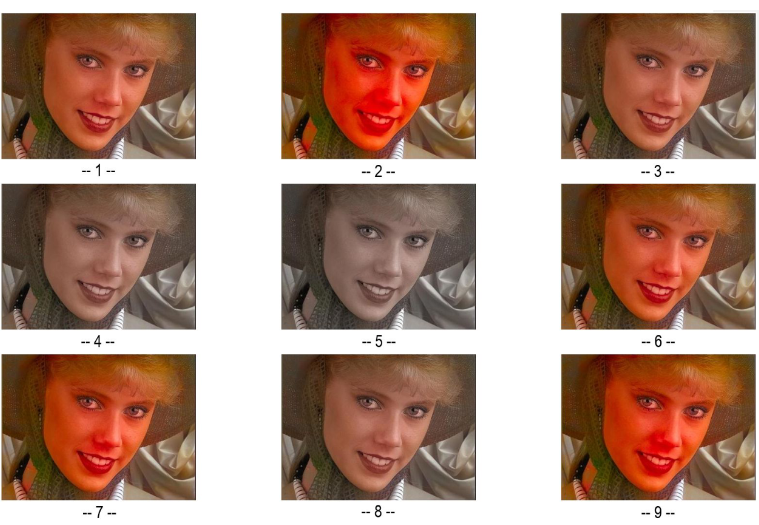
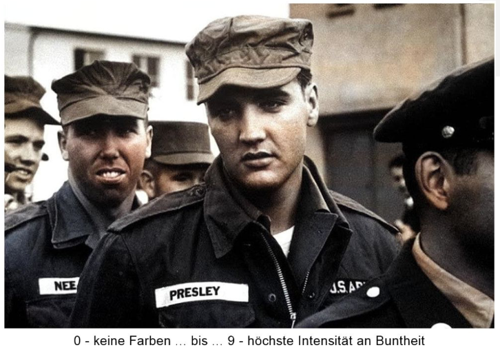

# Einfluss von Buntheit auf den wahrgenommenen Realismus rekolorierter Bilder

## Erdem Arslan, Savas Großmann, Marius Krause, Max Mühlefeldt

### Seminar: Visuelle Wahrnehmung beim Menschen und Bildqualität - WiSe 2021/22

## 1. Einleitung

Historische Schwarz-Weiß-Fotografien können mittels Machine Learning nachträglich eingefärbt bzw. rekoloriert werden. Wir untersuchen den Einfluss der Buntheit der eingefärbten Bilder auf den wahrgenommenen Realismus. Die vorliegende Fragestellung ist, welchen Einfluss die Buntheit auf den wahrgenommenen Realismus rekolorierter Bilder hat.

Zur Untersuchung der Fragestellung wurden historische und moderne Fotografien rekoloriert und nachträglich in ihrer Buntheit manipuliert.

Wir haben die Hypothese untersucht, dass ein bunteres, rekoloriertes Bild, als realistischer wahrgenommen wird.

### Buntheit

Zentraler Begriff der vorliegenden Untersuchung ist Buntheit bzw. Chroma. Allgemein ist Buntheit als Anteil von Schwarz __und__ Weiß in einer Farbe zu verstehen. Je mehr Schwarz- und Weißanteil in einer Farbe enthalten ist, desto geringer ist die Buntheit einer Farbe. Verdeutlicht wird dies und der Unterschied zur Sättigung im Farbtongleichen Dreieck [5]:



Basierend auf DIN EN ISO/CIE 11664-4 werden die Bilder in den CIELAB Farbraum konvertiert. Im CIELAB Farbraum, auch L*a*b* Farbraum genannt, ist die Buntheit von jedem Bildpunkt berechen- und manipulierbar. Für jeden Bildpunkt werden im CIELAB Farbraum die folgenden Informationen gespeichert:
* L*: Helligkeit
* a*: Rot-Grün-Buntheit
* b*: Gelb-Blau-Buntheit

Die Buntheit kann mittels `C*_ab = sqrt((a*)² + (b*)²)` für jeden Bildpunkt errechnet werden. Die Buntheit eines Bildpunktes ist somit von a* und b* abhängig. Eine einfache Darstellung des Zusammenhangs von a*, b* und der Buntheit im CIELAB Farbraum kann der folgenden Darstellungen entnommen werden [4]:



Durch die Änderung der Buntheit (Chroma in der Abb.) wird der Farbton nicht verändert (Hue in der Abb.).

Farbraumkonvertierungen vom sRGB- zum CIELAB Farbraum und umgekehrt wurden mittels des `skimage` Pakets für Python umgesetzt [2]:

```python
from skimage import io, color
original_color_lab_image = color.rgb2lab(io.imread(file_path))
```

Die Manipulation der Buntheit eines Bildes im CIELAB Farbraum erfolgt durch elementweise Matrixmultiplikation. Die Einträge für einen Bildpunkt werden mit dem Vektor [1, f, f], mit f als Faktor, um den die Buntheit angepasst wird:
* L*: Bleibt durch Multiplikation mit 1 unverändert.
* a* und b*: Beide Einträge werden durch die elementweise Multiplikation mit f angepasst.

Eine entsprechende Matrix für das gesamte Bild kann wie folgt erstellt werden.

```python
def get_modification_matrix(chroma_factor, requested_shape):
    """ Get matrix for element wise multiplication in the request shape.
    Usually the shape is equal to the shape of the original image
    as provided by the ML algorithm. """
    # Get the vector [1, f, f] with f as mod. factor.
    vector_to_multiply_elementwise = np.array([1, chroma_factor, chroma_factor])

    # Return matrix in the desired shape.
    return np.tile(
        vector_to_multiply_elementwise[None][None], (requested_shape[0], requested_shape[1], 1)
    )
```

Die elementweise Multiplikation erfolgt mittels der Funktion `modify_lab_image_chroma()`:

```python
def modify_lab_image_chroma(chroma_factor, image_to_modify):
    """ Modify the provided image in Lab color space by given chroma factor. """
    # Generate the modifier matrix.
    modifier = get_modification_matrix(chroma_factor, image_to_modify.shape)

    # Elementwise multiplication of original image.
    modified_image = image_to_modify * modifier
```

#### Hinweis zum CIELAB Farbraum
Die Buntheit im CIELAB Farbraum kann beliebig angepasst werden. Jedoch ist ein Konvertierung dieser Werte in einen anderen Farbraum nur noch bedingt möglich. Gerade für die Darstellung auf Computerbildschirmen ist eine Konvertierung in den sRGB-Farbraum notwendig. Entsprechend sieht auch das `skimage` Paket Limitierungen für die Konvertierung aus dem CIELAB Farbraum vor. So müssen a* und b* im Intervall [0, 100] in den reellen Zahlen liegen.

### Gewählte Bilder
Es wurden Bilder in zwei Gruppen ausgewählt: Historische und moderne Bilder.

#### Historische Bilder
Es wurden 30 historische Bilder aus verschiedenen Quellen zusammengetragen. Es wurden auf eine vielfältige Auswahl unterschiedlicher Themen geachtet.

#### Moderne Bilder
Die modernen Bilder stellen eine kleinere Kontrollgruppe von 15 Bildern dar. Mit diesen Bildern wurde der verwendete Machine Learning Algorithmus trainiert [1]. Die Bilder wurden der Tampere Image Database 2013 entnommen [3]. Die Bilder wurden aus thematischen Themen gewählt, die auch in der Gruppe der historischen Bildern zum Einsatz kommt.


### Machine Learning Modell
Zum Einsatz kommt hier ein bereits trainiertes Machine Learning Modell. Das Modell wurde durch Zhang et al. entwickelt [1]. Zu beachten ist, dass das Modell nur mittels moderner Bilder trainiert wurde. Im Training wurde ein Bild im CIELAB Farbraum, dessen Buntheitswerte a* und b* entfernt wurden, als Eingabe für das Modell verwendet. Der Output des Modells wurde mit dem originalen Bild, samt Buntheitswerten, verglichen. Basierend auf dem Vergleich erfolgte das Training des Modells.

Mit dieser Methode ist es nicht möglich das Modell mit den historischen Bildern zu trainieren, da ein Vergleich mit existierenden Buntheitswerten nicht möglich ist.

## 2. Vorbereitung der Stimuli
Wir beschreiben die Erstellung der Stimuli und beziehen uns auf die Ordner in `code/image_generation`. Die nachfolgenden Schritte sind auszuführen zur Erstellung der Stimuli.

* `00_base_images`: Ordner mit den ursprünglichen Bildern. Hier liegen die modernen Bilder noch als farbige Version vor.
* `01_conversion_modern_images_to_to_bw`: Mit Ausführung von `create_bw_colors.py` werden ausschließlich von den modernen Bildern aus `00_base_images/modern` in schwarz-weiße-Bilder umgewandelt. Die Bilder werden hierzu in den CIELAB-Farbraum konvertiert. Die Buntheitswerte der Bildpunkte werden im Anschluss auf 0 gesetzt. Zum Abschluss werden die Bilder im Unterordner `export` gespeichert.
* `02_recolor`: Zur Rekolorierung der historischen und modernen Bilder `recolor.py` ausführen. Der oben vorgestellte Machine Learning Algorithmus wird verwendet. Resultierende Bilder werden im Unterordner `export` gespeichert.
* `03_modify_chroma`: Zur Generierung der unterschiedlich bunten Versionen eines Bildes aus dem vorhergehenden Schritt `main.py` ausführen. Die resultierenden Bilder sowie eine individuelle Übersicht für jedes Bild werden im Ordner `04_completed_images` gespeichert.

## 3. Experimentelles Design

Unseren Versuch haben wir in zwei verschiedene Experimente aufgeteilt. Einmal das Hauptexperiment „Neuner“ und das Kontrollexperiment „Single“.
Die Testbilder werden mit der Python Anwendung `code/nines/generate_pictures_file.py` in die richtige Form und Größe gebracht, damit sie später bei den Versuchen benutzt werden können. Außerdem wird eine CVS Datei kreiert, welche der Neuner zur Nutzung der Bilder benötigt.

### Neuner
In unserem Hauptexperiment sehen Versuchspersonen jeweils dasselbe Bild in neun verschiedenen Buntheiten. Das originale Schwarz-Weiß-Bild ist in diesen Bildergruppen nicht vorhanden. Die Versuchsperson soll bei jeder Bildgruppe entscheiden welches Bild am realistischsten empfunden wird und mit einem Klick auf eine Zahl von eins bis neun die Entscheidung bestätigen.



Es wurden insgesamt 45 Bilder gezeigt. Aufgeteilt wurden diese Bilder in 30 historische und 15 moderne. Die Bilder wurden in jedem Durchlauf zufällig angeordnet, so dass die Chance minimiert wird, das Versuchspersonen beeinflusst werden durch vorherige Durchläufe.

Um selbst einen Versuch durchzuführen, müssen die Bilder im Pictures Ordner inklusive der `pictures.csv` gespeichert werden. Die Anwendung `code/nines/experiment_nines.py` kann dann gestartet werden. Diese liest `pictures.csv` aus und zeigt dem User die Bilder. Außerdem werden alle Eingaben des Users gespeichert und am Ende in einer CSV Datei im results Order gespeichert. Bei einem Neustart des Experiments werden die Bildergruppen wieder zufällig aneinandergereiht.

### Single
Bei unserem Kontrollexperiment wurde überprüft wie Bunt die Versuchspersonen das vom Algorithmus eingefärbte Bild empfinden. Hier haben wir für jede Bildergruppe lediglich ein Bild gezeigt und die Testperson sollte auf einer Skala von 0 (keine Farben) bis 9 (höchste Intensität an Buntheit) ihre Bewertung speichern.



Die Daten, welche wir durch den Single-Versuch bekommen haben, konnten wir mit denen des Neuners kombinieren, um interessante Schlüsse für unsere Hypothese zu ziehen.

Zum Starten des Kontrollexperiments müssen die Bilder, welche bewerten werden sollen, in den data Ordner. Die Anwendung `code/single_assessment/rating_experiment_single.py` zeigt der Testpersonen die Bilder in einer zufälligen Reihenfolge und speichert die Ergebnisse im result Order als CSV Datei.


## 4. Ergebnisse


### Qualitative Beobachtungen


## 5. Diskussion
Im Rahmen unseres Seminarprojekts haben die Auswertungen unserer Experimente gezeigt, dass Buntheit einen positiven Einfluss auf den wahrgenommenen Realismus hat. Anfänglich sind wir davon ausgegangen, dass wenn ein nachträglich eingefärbtes Bild bunter ist, es als realistischer wahrgenommen wird. Diese Erwartung hat sich nach den gewonnenen Erkenntnissen als wahr herausgestellt, jedoch nicht uneingeschränkt. Wir können zwar die Buntheit eines Bildes beliebig viel hochdrehen, aber ab einem bestimmten Punkt wird das Bild extrem unrealistisch, da die Farben ziemlich grell werden.

Wir stellen fest, dass wir die rekolorierten Bilder aus dem Machine Learning Algorithmus [1] bunter gestalten können und sie dadurch realistischer wirken. Folglich können wir sagen, dass wir mit unserer Vorgehensweise den Algorithmus von Zhang et al., bezogen auf den wahrgenommenen Realismus, verbessern können.


### Mögliche Probleme 
Es war nicht leicht die Aufgabenstellung unserer beiden Experimente kurz und genau zu erklären.
Dies führte dazu, dass im Nachhinein manchmal eine erneute mündliche Erklärung erfolgen musste, um genau klarzustellen, wonach im Experiment gefragt wird.
In einem Fall mussten wir die Ergebnisse des "Single" Kontrollexperiments verwerfen, da die Aufgabenstellung falsch interpretiert worden war.
Damit solche Missverständnisse vermieden werden können, wäre es sinnvoll eine kurze Erläuterung anhand eines Beispiels zum Experiment hinzuzufügen.

In unseren Bildergruppen hatten wir außerdem bekannte Persönlichkeiten, wie zum Beispiel Elvis. Es könnte sein,
dass die Versuchsperson Elvis vorher nur in Schwarz-Weiß kannte, welches dazu führen könnte, dass sie ein etwas unbunteres Bild
als realistischer empfindet. 

### Offene Fragen

## Referenzen
[1] Zhang et al. Colorful Image Colorization, ECCV Proceedings, 2016.

[2] scikit-image development team. Besucht am 21.03.2022, https://scikit-image.org/.

[3] Tampere Image Database. Besucht am 13.12.2021, https://www.ponomarenko.info/tid2013.htm.

[4] Konica Minolta. Precise Color Communication. Besucht am 08.12.2021, https://www.konicaminolta.com/instruments/download/booklet/index.html.

[5] Eva Lübbe. Farbempfindung, Farbbeschreibung und Farbmessung. 1. Auflage, Wiesbaden 2013.
